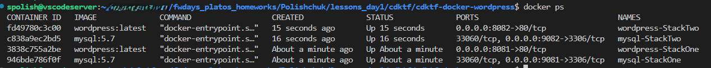
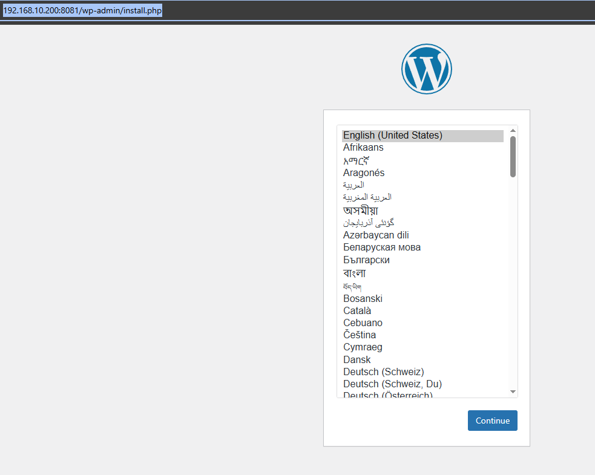
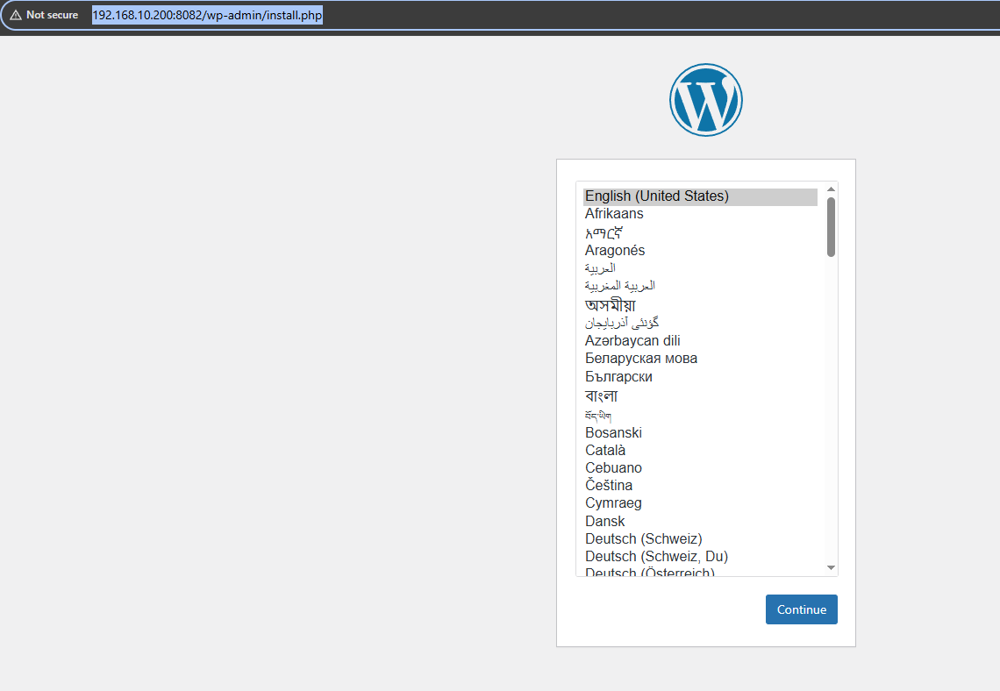

# Homework: Deploying WordPress with CDKTF and Docker


## ** Verification**

### **1. Check Running Containers**
```sh
docker ps
```

You should see two WordPress containers and two MySQL containers running.

### **2. Access WordPress**
Open your browser and navigate to:
- **StackOne:** [http://localhost:8081](http://localhost:8081)

- **StackTwo:** [http://localhost:8082](http://localhost:8082)


### **3. Destroy the Deployment**
Once you're done, clean up the environment:
```sh
cdktf destroy --auto-approve
```

---
### **Issues**
there was an issue with class import so instead of using 
```
import { DockerProvider, Container, Image, Network } from "@cdktf/provider-docker";
```
I used 
```
import { provider, container, image, network } from "@cdktf/provider-docker";
```
for image 
```
image: wordpressImage.latest,
```
used
```
image: wordpressImage.name,
```