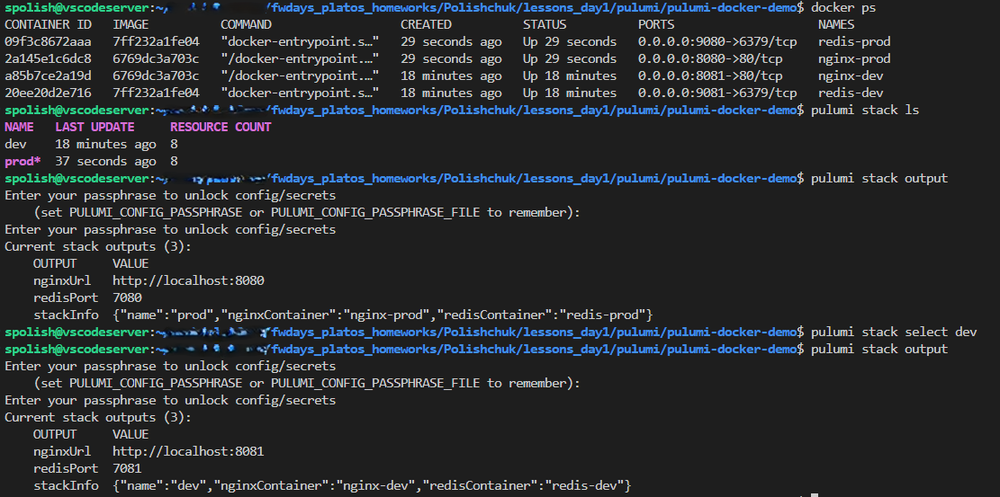
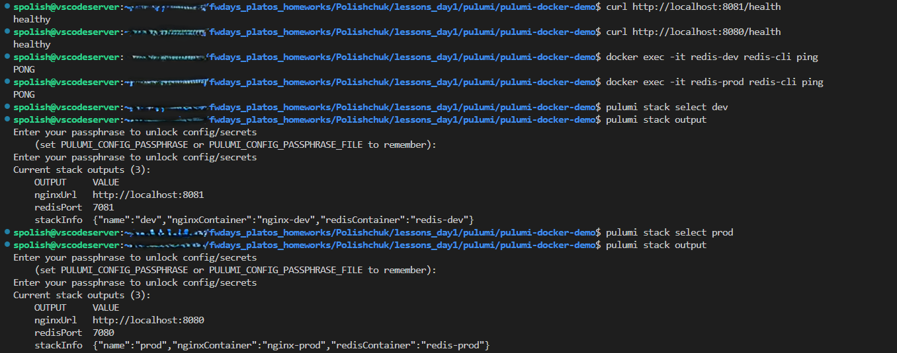

## ** Verification**

### **Step 1: Check Running Containers**
```sh
docker ps
```


### **Step 2: Access Web Applications**
Open your browser and navigate to:
- **Development Stack:** [http://localhost:8081](http://localhost:8081)
- **Production Stack:** [http://localhost:8080](http://localhost:8080)

### **Step 3: Test Health Endpoints**
```sh
# Test dev stack
curl http://localhost:8081/health

# Test prod stack  
curl http://localhost:8080/health
```
