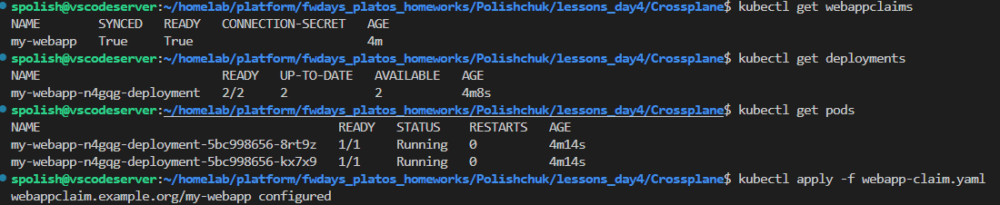
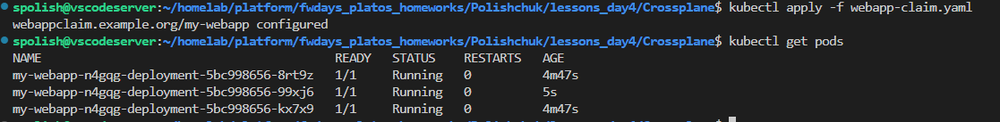

## ** Verification**

### **1. Check Resources**

```sh
kubectl get webappclaims
kubectl get deployments
kubectl get pods
```


### **2. Scale Application**
Update `webapp-claim.yaml`:

```yaml
spec:
  parameters:
    replicas: 3
```

Apply changes:
```sh
kubectl apply -f webapp-claim.yaml
```

